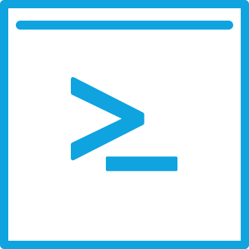
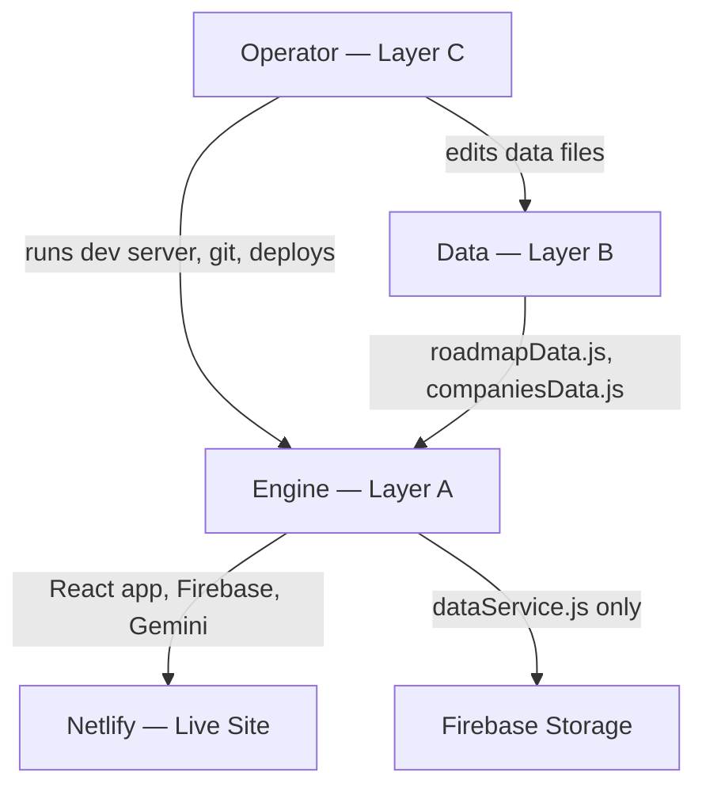

<div align="center">
  
  <h1>ATLAS</h1>
  <p><em>An execution-enforced IB Analyst Training OS</em></p>

  [![License][license-shield]][license-url]
  [![CI][ci-shield]][ci-url]
  [![Live Demo][demo-shield]][demo-url]
  [![Last Commit][commit-shield]][commit-url]
  [![React][react-shield]][react-url]
  [![Vite][vite-shield]][vite-url]
  [![Framer Motion][framer-shield]][framer-url]
  [![Firebase][firebase-shield]][firebase-url]

  [Live Demo][demo-url] · [Report Bug][bug-url]
</div>

---

## Table of Contents

- [About the Project](#about-the-project)
- [Key Features](#key-features)
- [Tech Stack](#tech-stack)
- [Architecture](#architecture)
- [Project Structure](#project-structure)
- [Getting Started](#getting-started)
- [Screenshots](#screenshots)
- [Roadmap](#roadmap)
- [Contributing](#contributing)
- [License](#license)
- [Author](#author)
- [Acknowledgments](#acknowledgments)

---

## About the Project

ATLAS is a personal execution OS for IB Analyst training. Roadmap steps are locked in sequence. Deliverables must be uploaded before a step completes. LinkedIn posts are generated from real work and scheduled automatically. The product is shipped, the progress is real, and every step completed is evidence of execution capability.

Work only counts when it exists.

| Approach | Problem |
|----------|---------|
| Spreadsheet tracker | No enforcement. Mark complete without doing the work. |
| Notion workspace | No gate. No sequential lock. Posts are manual. |
| ATLAS | Steps unlock only when the previous is complete. Deliverables must be uploaded. Posts are generated from real work and scheduled automatically. |

<!-- Dashboard screenshot added Phase 4 -->

---

## Key Features

- Locked sequential roadmap — steps unlock only when the previous is complete
- Deliverable upload gate — steps with required deliverables cannot be marked complete without a file upload
- Embedded Company Generator — fills the AI_Template prompt from `companiesData.js` and produces a ready-to-copy Claude Project prompt
- Auto-scheduled LinkedIn posts — completing a company step schedules its posts into the Calendar automatically
- Gemini-generated post content — LinkedIn posts reference actual uploaded deliverables
- Portfolio — every uploaded deliverable, downloadable, per step

---

## Tech Stack

| Layer       | Technology                                     |
| ----------- | ---------------------------------------------- |
| Frontend    | React 18, Vite, React Router v6, Framer Motion |
| Styling     | Custom CSS design system (ATLAS brand tokens)  |
| Backend     | Firebase (Auth, Firestore, Storage)            |
| AI          | Gemini API — LinkedIn post generation          |
| Deployment  | Netlify                                        |
| Development | Claude Project (Anthropic Claude)              |

---

## Architecture

**Layer A — Engine (AI-Owned).** React application: components, routing, state, Firebase, Gemini. Built and maintained by Claude Project (Anthropic Claude). Not hand-edited. Claude Code is used once, in Phase 4B, for a read-only hardening audit.

**Layer B — Data (User-Owned).** `src/data/roadmapData.js` and `src/data/companiesData.js`. Editable by the operator at any time. Claude Project may emit value-level patches to these files but never changes their schema, key names, or structure without operator approval.

**Layer C — Operator Workflow.** Running the dev server, verifying behavioral checklists, git commits, Netlify deploys. No code required.



`dataService.js` abstraction — when Firebase replaces localStorage, only this one file changes. Zero component rewrites.

---

## Project Structure
```
atlas/
├── public/
│   └── atlas-favicon.svg
├── src/
│   ├── components/
│   ├── pages/
│   ├── data/
│   │   ├── roadmapData.js      ← user-editable
│   │   └── companiesData.js    ← user-editable
│   ├── utils/
│   │   └── dataService.js      ← only file that touches storage
│   └── styles/
├── docs/
│   └── screenshots/            ← added Phase 4
├── .github/
│   ├── ISSUE_TEMPLATE/
│   ├── workflows/
│   ├── dependabot.yml
│   └── PULL_REQUEST_TEMPLATE.md
├── .env.example                ← copy to .env and fill in keys
├── CONTRIBUTING.md
├── CODE_OF_CONDUCT.md
├── SECURITY.md
└── README.md
```
---

## Getting Started

**Prerequisites**

- Node 18+
- Git
- Firebase project (if cloning for personal use)
- Gemini API key

**Installation**

```bash
git clone https://github.com/rirtakmanna/atlas.git
cd atlas
npm install
cp .env.example .env
# Fill in .env with your Firebase and Gemini keys
npm run dev
# Opens at http://localhost:5173
```

**Build for production**

```bash
npm run build
```

---

## Screenshots

<!-- Screenshots added after Phase 4 deployment -->

---

## Roadmap

- Build phases 0–4: Core app scaffold, Firebase integration, Gemini post generation, Netlify deployment — in progress
- Planned: Mobile app wrapper, additional company templates

---

## Contributing

This is a personal build. Bug reports and feature suggestions are welcome via GitHub Issues. Fork and PR if you want to contribute — follow the existing code style and ensure all checklist categories pass.

---

## License

MIT — see [LICENSE][license-url]

---

### Author

**Rirtak Manna**
[LinkedIn](https://linkedin.com/in/rirtak) · [GitHub](https://github.com/rirtakmanna)

[](https://github.com/rirtakmanna)

---

### Acknowledgments

- ATLAS_Brand_System — design language
- Anthropic Claude Project (Architect + Engineer); Claude Code (Phase 4B Hardening Auditor only)
- Firebase, Vite, React, Framer Motion teams

---

[license-shield]: https://img.shields.io/github/license/rirtakmanna/atlas?style=flat-square
[license-url]: ./LICENSE
[ci-shield]: https://github.com/rirtakmanna/atlas/actions/workflows/ci.yml/badge.svg
[ci-url]: https://github.com/rirtakmanna/atlas/actions/workflows/ci.yml
[demo-shield]: https://img.shields.io/badge/live-demo-success?style=flat-square
[demo-url]: https://atlas-rirtak.netlify.app
[commit-shield]: https://img.shields.io/github/last-commit/rirtakmanna/atlas?style=flat-square
[commit-url]: https://github.com/rirtakmanna/atlas/commits
[react-shield]: https://img.shields.io/badge/React-18-61DAFB?style=flat-square&logo=react
[react-url]: https://react.dev
[vite-shield]: https://img.shields.io/badge/Vite-646CFF?style=flat-square&logo=vite&logoColor=white
[vite-url]: https://vitejs.dev
[firebase-shield]: https://img.shields.io/badge/Firebase-FFCA28?style=flat-square&logo=firebase&logoColor=black
[firebase-url]: https://firebase.google.com
[framer-shield]: https://img.shields.io/badge/Framer_Motion-0055FF?style=flat-square&logo=framer&logoColor=white
[framer-url]: https://www.framer.com/motion/
[bug-url]: https://github.com/rirtakmanna/atlas/issues/new?template=bug_report.yml