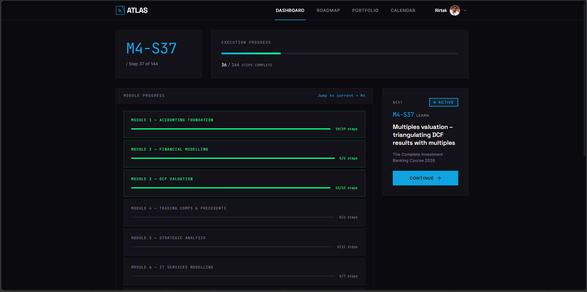
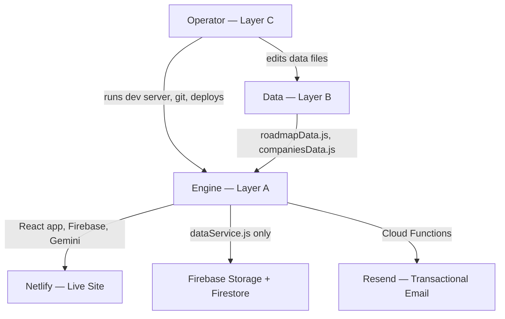
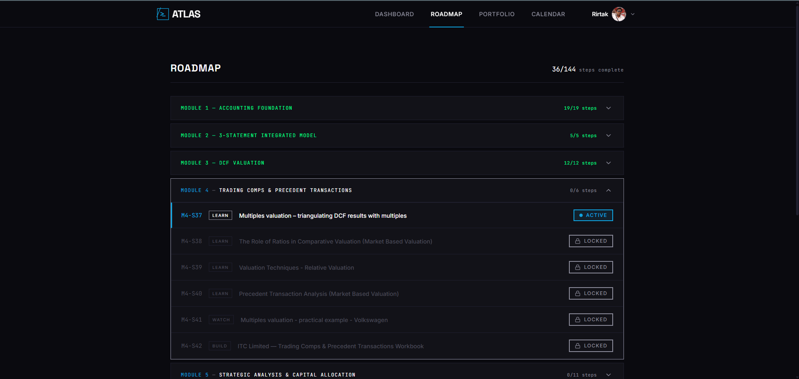
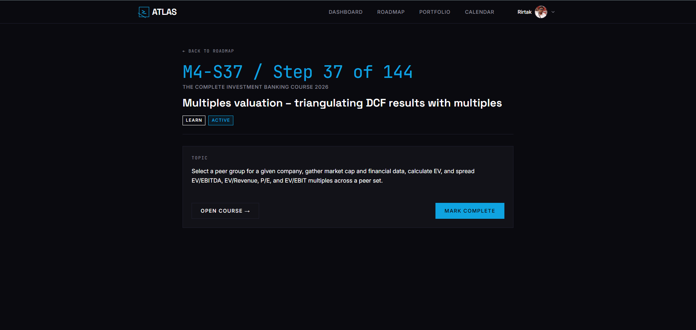
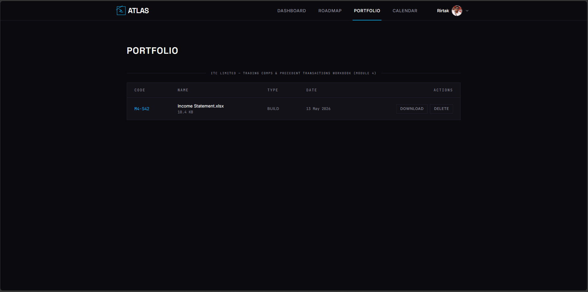
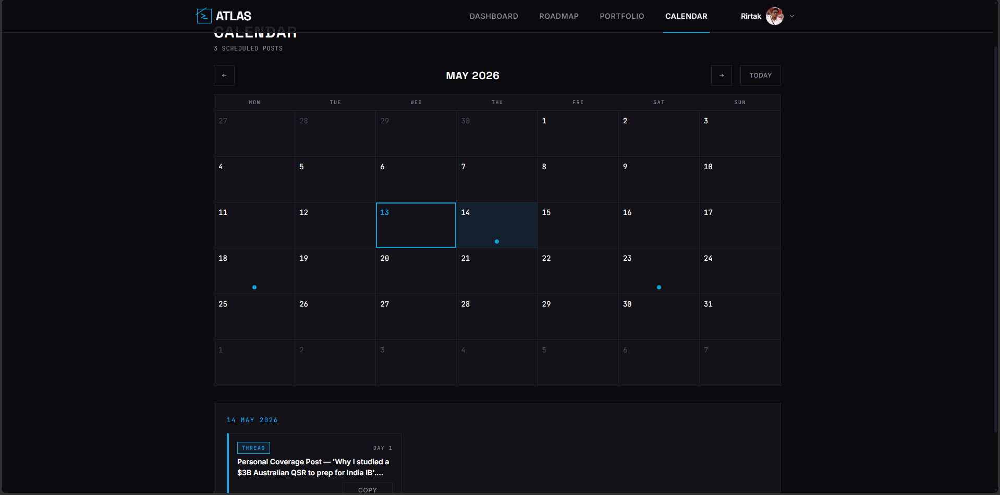

<div align="center">
  
  <h1>IBForge</h1>
  <p><em>A structured path from financial data work to a 10-model IB portfolio.</em></p>

  [![License][license-shield]][license-url]
  [![CI][ci-shield]][ci-url]
  [![Live Demo][demo-shield]][demo-url]
  [![Last Commit][commit-shield]][commit-url]
  [![React][react-shield]][react-url]
  [![Vite][vite-shield]][vite-url]
  [![Framer Motion][framer-shield]][framer-url]
  [![Firebase][firebase-shield]][firebase-url]

  [Live Demo][demo-url] · [Report Bug][bug-url]
</div>

---

## Table of Contents

- [About the Project](#about-the-project)
- [Key Features](#key-features)
- [Tech Stack](#tech-stack)
- [Architecture](#architecture)
- [Project Structure](#project-structure)
- [Getting Started](#getting-started)
- [Screenshots](#screenshots)
- [Roadmap](#roadmap)
- [For Prospective Customers](#for-prospective-customers)
- [For Prospective Employers](#for-prospective-employers)
- [Contributing](#contributing)
- [License](#license)
- [Author](#author)
- [Acknowledgments](#acknowledgments)

---

## About the Project

IBForge is a personal execution OS for IB Analyst training. I built it because every other system I tried — spreadsheet trackers, Notion workspaces, course dashboards — had the same flaw: nothing stopped me from marking something done without doing it. IBForge enforces the work. Roadmap steps are locked in sequence. Deliverables must be uploaded before a step completes. LinkedIn posts are generated from actual completed work and scheduled automatically. The product is shipped, the progress is real, and every step completed is evidence of execution capability.

Work only counts when it exists.

| Approach | Problem |
|----------|---------|
| Spreadsheet tracker | No enforcement. Mark complete without doing the work. |
| Notion workspace | No gate. No sequential lock. Posts are manual. |
| IBForge | Steps unlock only when the previous is complete. Deliverables must be uploaded. Posts are generated from real work and scheduled automatically. |

<p align="center">
  
</p>

---

## Key Features

- Locked sequential roadmap — steps unlock only when the previous is complete
- Deliverable upload gate — steps with required deliverables cannot be marked complete without a file upload
- Embedded Company Generator — fills the AI_Template prompt from `companiesData.js` and produces a ready-to-copy Claude Project prompt
- Auto-scheduled LinkedIn posts — completing a company step schedules its posts into the Calendar automatically
- Gemini-generated post content — LinkedIn posts reference actual uploaded deliverables
- Portfolio — every uploaded deliverable, downloadable, per step
- Access control — trial and paid tiers, manual UPI payment intake, admin approval console

---

## Tech Stack

| Layer       | Technology                                      |
| ----------- | ----------------------------------------------- |
| Frontend    | React 18, Vite, React Router v6, Framer Motion  |
| Styling     | Custom CSS design system (IBForge brand tokens) |
| Backend     | Firebase (Auth, Firestore, Storage, Functions)  |
| AI          | Gemini 2.5 Flash Lite — Company Generator + LinkedIn post generation |
| Email       | Resend (transactional), ImprovMX (forwarding)   |
| Deployment  | Netlify (hosting + custom domain)               |
| Development | Claude Project (Anthropic Claude)               |

---

## Architecture

**Layer A — Engine (AI-Owned).** React application: components, routing, state, Firebase, Gemini. Built and maintained by Claude Project (Anthropic Claude). Not hand-edited. Claude Code used once, in Phase 4B, for a read-only hardening audit.

**Layer B — Data (User-Owned).** `src/data/roadmapData.js` and `src/data/companiesData.js`. Editable by the operator at any time. Claude Project may emit value-level patches to these files but never changes their schema, key names, or structure without operator approval.

**Layer C — Operator Workflow.** Running the dev server, verifying behavioral checklists, git commits, Netlify deploys. No code required from the operator.



`dataService.js` is the sole abstraction layer — it is the only file that reads or writes state. When Firebase replaced localStorage, only this one file changed. Zero component rewrites.

---

## Project Structure

```
ibforge/
├── public/
│   ├── atlas-favicon.svg
│   └── _redirects                  ← Netlify SPA rewrite rule
├── src/
│   ├── components/
│   │   └── admin/                  ← Admin-only components (SubmissionRow, CodesTable, ScreenshotModal)
│   ├── pages/
│   ├── data/
│   │   ├── roadmapData.js          ← user-editable, never regenerated by AI
│   │   └── companiesData.js        ← user-editable, never regenerated by AI
│   ├── utils/
│   │   └── dataService.js          ← only file that touches storage
│   └── styles/
├── functions/                      ← Firebase Cloud Functions (Node 20)
│   ├── index.js                    ← claimCode, issueTrialCode, approveSubmission, rejectSubmission, mintManualCode
│   └── .env                        ← IBFORGE_ADMIN_UID (gitignored)
├── netlify/
│   └── functions/
│       └── gemini.js               ← Gemini serverless proxy (API key never in client bundle)
├── scripts/                        ← seed and admin utility scripts
├── docs/
│   └── screenshots/
├── .github/
│   ├── ISSUE_TEMPLATE/
│   ├── workflows/
│   │   └── ci.yml
│   ├── dependabot.yml
│   └── PULL_REQUEST_TEMPLATE.md
├── .env.example                    ← key names only, no values (committed)
├── .firebaserc
├── firestore.rules
├── storage.rules
├── firestore.indexes.json
├── CONTRIBUTING.md
├── CODE_OF_CONDUCT.md
├── SECURITY.md
└── README.md
```

---

## Getting Started

**Prerequisites**

- Node 20+
- Git
- Firebase project (if cloning for personal use)
- Gemini API key

**Installation**

```bash
git clone https://github.com/rirtakmanna/ibforge.git
cd ibforge
npm install
cp .env.example .env
# Fill in .env with your Firebase and Gemini keys
npm run dev
# Opens at http://localhost:5173
```

**Build for production**

```bash
npm run build
```

---

## Screenshots

### Roadmap — sequential lock enforcement

Every step is locked until the previous is complete. The accordion groups steps by Module; locked, active, and complete states are visually distinct.

<p align="center">
  
</p>

### Step Detail — APPLY + BUILD

Company steps split into APPLY (focus, valuation methods, financial models, sub-page navigation to Generate Project and LinkedIn Posts) and BUILD (deliverable spec, upload zone, uploaded files list, Mark Complete gate).

<p align="center">
  
</p>

### Portfolio — every uploaded deliverable

Filter chips appear only for steps with uploads. Files are downloadable and deletable.

<p align="center">
  
</p>

### Calendar — auto-scheduled LinkedIn posts

Completing a company step schedules its LinkedIn posts onto the Calendar at their day-offsets. Each scheduled date shows a marker; clicking a date reveals the posts due that day.

<p align="center">
  
</p>

---

## Roadmap

- Build phases 0–4C: Core app scaffold, Firebase integration, Gemini post generation, Netlify deployment, paid access layer, admin console — complete
- Phase 4D: Hardening pass — in progress
- Planned: Mobile app wrapper, additional company templates

---

## For Prospective Customers

IBForge is a structured 14-module curriculum that builds the portfolio you can show in interviews. Each module learns first, applies on a real listed company, and delivers a model or analysis as a concrete file.

- **Trial:** free Module 1 — request a code at [ibforge.in](https://ibforge.in)
- **Full access:** ₹2,499 one-time (early access pricing for first 20 customers: ₹1,699)
- **Refund window:** 7 days, no questions asked
- **Contact:** [hello@ibforge.in](mailto:hello@ibforge.in)

---

## For Prospective Employers

This repository demonstrates end-to-end product execution built independently, including:

- Single-tool AI engineering workflow (Claude Project as architect and engineer, operator as builder)
- Atomic Firestore transactions for payment approval
- Firebase Cloud Function security (UID-gated admin callables, Secret Manager for API keys)
- Manual payment intake without a payment processor — UTR verification, admin approval, code generation
- Brand system implementation from a written spec — no Tailwind, no component library, custom CSS design tokens throughout
- Responsive layout at three breakpoints with no hamburger menu

Phase-by-phase commit history shows incremental shipping discipline. Each phase ends with a passing 6-category behavioral checklist before any commit is made.

**Note on naming:** Early commits reference the project as "ATLAS" — its working title during the personal-build phase. The project rebranded to IBForge when commercial launch began in Phase 4A. This history is preserved deliberately; rewriting it would destroy the evidentiary trail.

---

## Contributing

This is a personal build. Bug reports and feature suggestions are welcome via GitHub Issues. Fork and PR if you want to contribute — follow the existing code style and ensure all checklist categories pass.

---

## License

© 2026 Rirtak Manna. All rights reserved.

This is a commercial product. The source code is published for portfolio and transparency purposes. No license is granted for reuse, redistribution, or derivative works. Contact [hello@ibforge.in](mailto:hello@ibforge.in) for licensing inquiries.

---

### Author

**Rirtak Manna**
[LinkedIn](https://linkedin.com/in/rirtak) · [GitHub](https://github.com/rirtakmanna)

---

### Acknowledgments

- ATLAS_Brand_System — design language
- Anthropic Claude Project (Architect + Engineer); Claude Code (Phase 4B Hardening Auditor only)
- Firebase, Vite, React, Framer Motion teams

---

[license-shield]: https://img.shields.io/badge/license-All%20Rights%20Reserved-red?style=flat-square
[license-url]: ./LICENSE
[ci-shield]: https://github.com/rirtakmanna/ibforge/actions/workflows/ci.yml/badge.svg
[ci-url]: https://github.com/rirtakmanna/ibforge/actions/workflows/ci.yml
[demo-shield]: https://img.shields.io/badge/live-demo-success?style=flat-square
[demo-url]: https://ibforge.in
[commit-shield]: https://img.shields.io/github/last-commit/rirtakmanna/ibforge?style=flat-square
[commit-url]: https://github.com/rirtakmanna/ibforge/commits
[react-shield]: https://img.shields.io/badge/React-18-61DAFB?style=flat-square&logo=react
[react-url]: https://react.dev
[vite-shield]: https://img.shields.io/badge/Vite-646CFF?style=flat-square&logo=vite&logoColor=white
[vite-url]: https://vitejs.dev
[firebase-shield]: https://img.shields.io/badge/Firebase-FFCA28?style=flat-square&logo=firebase&logoColor=black
[firebase-url]: https://firebase.google.com
[framer-shield]: https://img.shields.io/badge/Framer_Motion-0055FF?style=flat-square&logo=framer&logoColor=white
[framer-url]: https://www.framer.com/motion/
[bug-url]: https://github.com/rirtakmanna/ibforge/issues/new?template=bug_report.yml